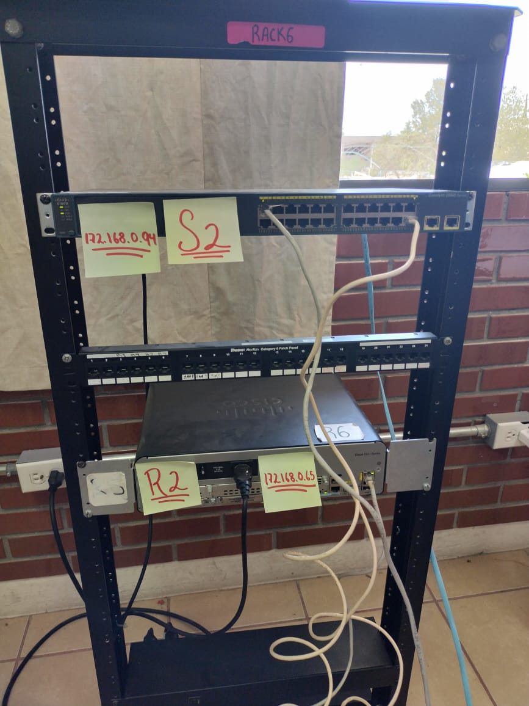

Aqui se muestra una imagen de la topología fisica que se realizo en el laboratorio de cisco, y se muestra el Swich 1 con la interface vlan con la ip 172.168.0.62, y tambien se muestra el Router 1 con la ip 172.168.0.1 

Aqui se muestra una imagen de la topología fisica que se realizo en el laboratorio de cisco, y se muestra el Swich 2 con la interface vlan 1 con la ip 172.168.0.94, y tambien se muestra el Router 2 con la ip 172.168.0.65 

